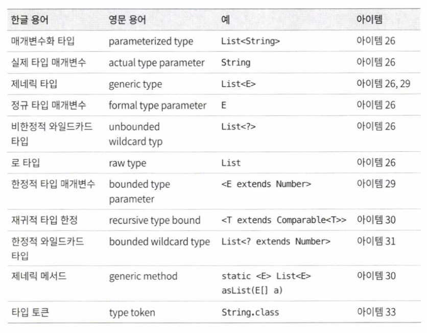

# 5장 제네릭

제네릭은 자바 5부터 사용 가능

제네릭을 사용하면 컬렉션이 담을 수 있는 타입을 컴파일러에 알려주게 됨 -> 컴파일러는 알아서 형변환 코드를 추가 할 수 있음 -> 엉뚱한 타입 객체를 넣으려는 시도를 컴파일 과정에서 차단 가능 -> 더 안전하고 명확한 프로그램을 만들 수 있음

단, 코드가 복잡해진다는 단점이 있음

5장에서는 제네릭의 이점을 최대로 살리고 단점을 최소화하는 방법을 이야기한다.

[TOC]


## 아이템 26. 로 타입(Raw Type)은 사용하지 말라

-------

> 용어 정리
>
> 제네릭 클래스/제네릭 인터페이스 : 클래스와 인터페이스 선언에 타입 매개변수를 씀  ex) List<E>
>
> 제네릭 클래스와 제네릭 인터페이스를 통틀어 제네릭 타입이라 한다.

제네릭 타입을 하나 정의하면 그에 딸린 로 타입도 함께 정의된다.

로타입이란 제네릭타입에서 타입 매개변수를 전혀 사용하지 않을 때를 말한다.

예를 들면 List<E>의 로타입은 List

로타입은 타입 선언에서 제네릭 타입 정보가 전부 지워진 것처럼 동작하는데, 제네릭이 도래하기 전 코드와 호환되도록 하기 위한 궁여지책이라 할 수 있다.


로타입의 안좋은 예를 보자.

```java
//제네릭 지원하기전 컬렉션 선언 - 컬렉션의 로 타입 -> 따라 하지 말 것!
private final Collection stamps = ...;
// 이 코드를 사용하면 stmap 대신 Coin을 넣어도 아무 오류 없이 컴파일되고 실행된다.  -> unchecked call 경고 나타남
stamps.add(new Coin(...)); 
// 컬렉션에서 동전을 꺼내기 전에는 오류를 알아채지 못함
for (Iterator i = stamps.iterator(); i.hasNext(); ) {
	Stamp stamp = (Stamp) i.next(); // ClassCastException 발생
  stamp.cancel();
}
```

오류는 가능한 한 발생 즉시, 이상적으로는 컴파일할 때 발견하는 것이 좋다. 

위 예제처럼 런타임에야 알아채면 런타임 문제를 겪는 코드와 원인을 제공한 코드가 물리적으로 상당히 떨어져 있을 가능성이 커진다.

```java
// 매개변수화된 컬렉션 타입 - 타입 안정성 확보
private final Collection<Stamp> stamps = ...;
stamps.add(new Coin(...));  // 컴파일 에러 발생
```

이렇게 선언하면 컴파일러는 Stamp 인스턴스만 넣어야 함을 컴파일러가 인지하게 된다. 따라서 아무런 경고 없이 컴파일 된다면 의도대로 동작할 것임을 보장한다.

위의 예제가 억지스러보일 수도 있지만 대표적으로 BigDecimal용 컬렉션에 BigInteger를 넣는 실수가 있다.


로타입을 쓰는 걸 언어 차원에서 막아 놓지는 않았지만 **절대로 써서는 안 된다**.

-> 로타입을 쓰면 제네릭이 안겨주는 안정성과 표현력을 모두 잃게 된다.

그럼 왜 로 타입을 만들어 놓은 것일까? 

- 제네릭이 받아들이기 까지 약 10년이 걸림 -> 제네릭 없이 짠 코드가 이미 많음 -> 기존 코드 모두 수용하면서 제네릭을 사용하는 새로운 코드와 맞물려 돌아가게 해야만 했음
- 마이그레이션 호환성을 위해 로 타입을 지원하고 제네릭 구현에는 소거 방식을 사용하기로 했다.


### List와 같은 로 타입은 안되지만 List<Object>는 괜찮다.

- List는 제네릭 타입에서 완전히 발을 뺀 거

- List<Object>는 모든 타입을 허용한다는 의미를 컴파일러에 명확히 전달하고 있음

  - 매개변수로 List를 받는 메서드에 List<String>을 넘길수는 있지만, List<Object>를 받는 메서드에는 넘길 수 없다.

    ```java
    public static void main(String[] args) {
      List<String> strings = new ArrayList<>();
      unsafeAdd(strings,Integer.valueOf(42));
      String s = strings.get(0); 
    }
    
    public static void unsafeAdd(List list,Object o){
    	list.add(o); // Unchecked call to 'add(E)' as a member of raw type 'java.util.List' 
    }
    
    // 컴파일은 되지만, list.add에서 경고가 발생하며, 프로그램 실행시 strings.get(0)의 결과를 형변환하려 할 때 ClassCastException 던진다.
    // 컴파일런가 Integer를 String으러 변환 시도. 경고를 무시하고 실행하여 에러 발생 한것.
    ```

    ```java
    public static void main(String[] args) {
    	List<String> strings = new ArrayList<>();
    	unsafeAdd(strings,Integer.valueOf(42));  // 컴파일 에러
    	String s = strings.get(0);
    }
    
    public static void unsafeAdd(List<Object> list,Object o){
    	list.add(o);
    }
    ```


### 원소의 타입을 몰라도 되는 로 타입을 쓰고 싶다?  와일드카드 타입을 사용하자.

```java
// 잘못된 예 - 모르는 타입의 원소도 받는 로 타입을 사용했다.
// 메서드는 동작하지만, 로타입을 사용해 안전하지 않다.
static int numElementsInCommon(Set s1, Set s2){
  int result = 0;
  for (Object o1:s1){
    if(s2.contains(o1)){
      result++;
    }
  }
  return result;
}
```

원소타입 몰라도 되는 로타입을 사용하고 싶다면 와일드 카드를 사용하는게 좋다.

제네릭 타입 쓰고 싶은데, 실제 타입 매개변수가 무엇인지 신경 쓰고 싶지 않다면 **물음표(?)**를 사용하자.

- Set<E>의 비한정적 와일드카드 타입은 Set<?>  -> 어떤 타입이라도 담을 수 있는 가장 범용적인 매개변수화 Set 타입

```java
static int numElementsInCommon(Set<?> s1, Set<?> s2){}
```

비한정적 와일드카드 타입(Set<?>)과 로타입(Set)의 차이점은?

- 와일드카드 타입은 안전하고, 로타입은 안전하지 않다.
  - 로타입 컬렉션에는 아무 원소나 넣을 수 있으니 타입 불변식을 훼손하기 쉽다.
  - Collection<?>에는 (null외에는) 어떤 원소도 넣을 수 없다. 다른 원소 넣으려고 하면 컴파일 에러 발생 -> 컬렉션의 타입 불변식을 훼손하지 못하게 막았다.


Collection<?>에 어떤 원소도 넣지 못하고, 꺼낼 수 있는 객체의 타입도 전혀 알 수 없다. 

이러한 제약을 받아 들일 수 없다면 **제네릭 메서드**나 **한정적 와일드카드 타입**을 사용하면 된다.


### 로 타입 쓰지 말라는 규칙의 예외사항

- class 리터럴에는 로타입을 써야한다.

  - List.class, String[].class -> 허용
  - List<String>.class, List<?>.class -> 허용하지 않음

- instanceof 연산자 쓸 때

  - 런타입에는 제네릭 타입 정보가 지워진다. instanceof 연산자는 비한정적 와일드카드 타입(Set<?>) 이외의 매개변수화 타입에는 적용할 수 없다.
  - 로타입이든 비한정적 와일드카드 타입이든 instanceof 똑같이 동작한다.

  ```java
  # 로 타입을 써도 좋은 예 : instanceof 연산자
  if(o instanceof Set){
  	Set<?> s = (Set<?>) o;
  	//...
  }
  ```

  

### 핵심정리

- 로타입 사용하면 런타임에 예외 발생 할 수 있으니 사용하면 안된다.

- 로타입은 제네릭 도입되기 이전 코드와의 호환성을 위해 제공될 뿐이다.

- Set<Object>는 어떤 타입의 객체도 저장할 수 있는 매개변수화 타입

- Set<?>는 모종의 타입 객체만 저장할 수 있는 와일드카드 타입

- Set (로타입)은 제네릭 타입 시스템에 속하지 않는다.

- Set<Object>, Set<?>는 안전하지만, Set는 안전하지 않다.





## 아이템 27. 비검사 경고를 제거하라

-------

제네릭 사용하기 시작하면 수많은 컴파일러 경고를 보게 된다.

- 비검사 형변환 경고
- 비검사 메서드 호출 경고
- 비검사 매개변수화 가변인수 타입 경고
- 비검사 변환 경고

### 할 수 있는 한 모든 비검사 경고를 제거하라

```java
Set<Lark> exaltation = new HashSet(); // required: Set<Lark> found: HashSet 

Set<Lark> exaltation = new HashSet<>(); //다이아몬드 연산자만으로 해결 가능
```

모든 비검사 경고를 제거한다면 그 코드는 타입 안정성이 보장된다.

- 즉, 런타임에  ClassCastException이 발생할 일이 없고, 의도한대로 잘 동작하리라 확신할 수 있다.


### 경고를 제거할 수 없지만 타입 안전하다고 확신한다면 @SuppressWarnings("unchecked") 애너테이션을 달아 경고를 숨기자.

단, 타입 안전함을 검증하지 않은 채 경로를 숨기면 스스로에게 잘못된 보안 인식을 심어주는 꼴이다.

- 경고 없이 컴파일 되지만, 런타임에는 여전히 ClassCastException을 던질 수 있다.

한편, 안전하다고 검증된 비검사 경고를 숨기지 않고 그대로 두면, 진짜 문제를 알리는 새로운 경고가 나와도 눈치채지 못할 수 있다.

- 제거하지 않은 수많은 거짓 경고 속에 새로운 경고가 파묻힐것이기 때문

### @SuppressWarnings 애너테이션은 항상 가능한 좁은 범위에 적용하자.

절대로 클래스 전체에 적용해서는 안된다.

한줄이 넘는 메서드나 생성자에 달린 @SuppressWarnings 애너테이션을 발견하면 지역변수 선언 쪽으로 옮기자.

```java
//ArrayList의 toArray
public <T> T[] toArray(T[] a) {
  if (a.length < size) {
  	return (T[])Arrays.copyOf(elements, size, a.getClass()); // Unchecked cast: 'java.lang.Object[]' to 'T[]' 
  }
  System.arraycopy(elements, 0, a, 0, size);

  if (a.length > size) {
  	a[size] = null;
  }
  return a;
}

// 지역변수를 추가해 @SuppressWarnings의 범위를 좁힌다.
public <T> T[] toArray(T[] a) {
  if (a.length < size) {
    @SuppressWarnings("unchecked")
    T[] result = (T[])Arrays.copyOf(elements, size, a.getClass());
    return result;
  }
  System.arraycopy(elements, 0, a, 0, size);

  if (a.length > size) {
  	a[size] = null;
  }
  return a;
}
```


### @SuppressWarnings("unchecked") 애너테이션을 사용할 때면 그 경고를 무시해도 안전한 이유를 항상 주석으로 남겨라

다른 사람이 그 코드를 이해하는데 도움이 되며, 더 중요하게는, 다른 사람이 그 코드를 잘못 수정하여 타입 안정성을 잃는 상황을 줄여준다.

코드가 안전한 근거가 쉽게 떠오르지 않더라도 끝까지 포기하지 말자. 근거를 찾는 중에 그 코드가 사실은 안전하지 않다는 걸 발견할 수도 있으니 말이다.


### 핵심정리

비검사 경고는 중요하니 무시하지 말자.

모든 비검사 경고는 런타임에 ClassCastException을 일으킬 수 있는 잠재적 가능성을 뜻하니 최선을 다해 제거하라.

경고를 없앨 방법을 찾지 못하겠다면, 그 코드가 타입 안전함을 증명하고 가능한 한 범위를 좁혀 @SuppressWarnings("unchecked") 애너테이션으로 경고를 숨겨라

그런 다음 경고를 숨기기로 한 근거를 주석을 남겨라.


## 아이템 28. 배열보다는 리스트를 사용하라

-------

### 배열 vs 제네릭

배열과 제네릭 타입에는 중요한 차이가 두가지가 있다.

1. 배열은 공변이다.

   - 공변 : 함께 변한다.

   - Sub가 Super의 하위 타입이라면 배열 Sub[]는 배열 Super[]의 하위타입이 된다.

   - Type1,Type2가 있을 때, List<Type1>은 List<Type2>의 하위타입도 아니고 상위타입도 아니다.

     제네릭에 문제가 있다고 생각할 수 있지만, 사실 문제가 있는 건 배열쪽이다.

     ```java
     // 런타임에 실패한다.
     Object[] objectArray = new Long[1];
     objectArray[0] = "타입이 달라 넣을 수 없다."; // Exception in thread "main" java.lang.ArrayStoreException: java.lang.String 
     ```

     ```java
     // 컴파일되지 않음
     List<Object> ol = new ArrayList<Long>(); // 호환되지 않는 타입
     ol.add("타입이 달라 넣을 수 없다.");
     ```

2. 배열은 실체화된다.
   - 배열은 런타임에도 자신이 담기로 한 원소의 타입을 인지하고 확인한다.
   - 제네릭은 타입 정보가 런타임에는 소거된다.
     - 소거는 제네릭이 지원되기 전의 레거시 코드와 제네릭 타입을 함께 사용할 수 있게 해주는 메커니즘으로, 자바 5가 제네릭으로 순조롭게 전환될 수 있도록 해줬다.

위 두가지의 주요 차이로 배열과 제네릭은 잘 어우러지지 못한다.


배열은 제네릭타입,매개변수화 타입, 타입 매개변수로 사용할 수 없다.

즉, `new List<E>[]`,`new List<String>[]`,`new E[]`식으로 작성하면 컴파일할 때 제네릭 배열 생성 오류를 일으킨다.


### 제네릭 배열을 만들지 못하게 막은 이유는 무엇일까?

- 타입이 안전하지 않기 때문이다.

이를 허용하게되면 컴파일러가 자동 생성한 형변환 코드에서 런타임에 ClassCastException이 발생할 수 있다.

런타임에 ClassCastException이 발생하는 일을 막아주겠다는 제네릭 타입 시스템의 취지에 어긋나는 것이다.

다음 코드로 구체적인 상황을 살펴보자.

```java
List<String>[] stringLists = new List<String>[1];       //1
List<Integer> intList = Collections.singletonList(42);  //2
Object[] objects = stringLists;													//3
objects[0] = intList;																		//4
String s = stringLists[0].get(0);												//5
```

제네릭 배열을 생성하는 (1)이 허용된다고 가정해보자.

(2)는 원소가 하나인 List<Integer>를 생성한다.

(3)은 (1)에서 생성한 List<String>배열을 Object 배열에 할당한다. 배열은 공변이니 아무 문제 없다.

(4)는 (2)에서 생성한 List<Integer>의 인스턴스를 Object배열의 첫 원소로 저장한다. 제네릭은 소거 방식으로 구현되어 이 역시 성공한다.

즉, 런타임에는 List<Integer> 인스턴스의 타입이 List가 되고, List<Integer>[] 인스턴스의 타입은 List[]가 된다.

따라서 (4)에서도 ArrayStoreException을 일으키지 않는다.

List<String> 인스턴스만 담겠다고 선언한 stringLists배열에는 지금 List<Integer> 인스턴스가 저장되어 있다.

그리고 (5)는 이 배열의 처음 리스트에서 첫 원소를 꺼내려한다. 

컴파일러는 꺼낸 원소를 자동으로 String으로 형변환하는데, 원소가 Integer이므로 런타임에 ClassCastException이 발생한다.

이런 일을 방지하려면 (1)에서 제네릭 배열이 생성되지 않도록 컴파일 오류를 내야한다.


 `List<E>`,`List<String>`,`E` 같은 타입을 실체화 불가 타입이라 한다.

- 실체화 되지않아서 런타임에는 컴파일 타임보다 타입 정보를 적게 가지는 타입
- 소거 메커니즘 때문에 매개변수화 타입 가운데 실체화 될 수 있는 타입은 List<?>, Map<?,?> 같은 비한정적 와일드 카드 타입뿐이다.
  - 배열을 비한정적 와일드카드 타입으로 만들수 있지만, 유용하게 쓰일 일은 거의 없다.

제네릭 컬렉션에서 자신의 원소타입을 담은 배열을 반환하는게 불가능하다 . 

- 완벽하지 않지만 대부분의 상황에서 이문제를 해결해주는 방법은 아이템33. 타입 안전 이종컨테이너를 고려하라를 참고

제네릭 타입과 가변인수 메서드를 함께 쓰면 해석하기 어려운 경고 메세지를 받게 된다. 가변인수메서드를 호출할 때마다 가변인수 매개변수를 담을 배열이 하나 만들어지는데, 이때 그 배열의 원소가 실체화 불가 타입이라면 경고가 발생하는 것이다.

- 이 문제는 @SafeVarargs 애너테이션으로 대처할 수 있다.(아이템32. 제네릭과 가변인수를 함께 쓸 때는 신중하라)

  ```java
  // warning Possible heap pollution from parameterized vararg type 
  static void dangerous(List<String>... stringLists){
  	List<Integer> integerList = Collections.singletonList(42);
  	Object[] objects = stringLists;
  	objects[0] = integerList;           //힙 오염 발생
  	String s = stringLists[0].get(0);   //ClasCastException
  }
  
  @SafeVarargs
  static void dangerous(List<String>... stringLists){
    //...
  }
  ```


배열로 형변환할 때 제네릭 배열 생성 오류나 비검사 형변화 경고가 뜨는 경우 대부분은 배열인 `E[]` 대신 컬렉션인 `List<E>`를 사용하면 해결된다.

- 코드가 조금 복잡해지고 성능이 살짝 나빠질 수도 있지만, 그 대신 타입 안전성과 상호운용성은 좋아진다.


### 핵심정리

- 배열과 제네릭에는 매우 다른 타입 규칙이 적용된다.
- 배열은 공변이고 실체화된다.
- 제네릭은 불공변이고 타입 정보가 소거된다.
- 그 결과 배열은 런타임에는 타입 안전하지만 컴파일타임에는 그렇지 않다.
  - 제넥릭은 그 반대다
  - 그래서 둘은 섞어 쓰기란 쉽지 않다.
- 둘을 섞어 쓰다가 컴파일 오류나 경고를 만나면, 가장 먼저 배열을 리스트로 대체하는 방법을 적용해보자.


## 아이템 29. 이왕이면 제네릭 타입으로 만들라

클라이언트에서 직접 형변환해야하는 타입보다 제네릭 타입이 더 안전하고 쓰기 편하다.

그러니 새로운 타입을 설계할 때는 형변환 없이도 사용할 수 있도록 하라.

그렇게 하려면 제네릭 타입으로 만들어야 할 경우가 많다.

기존 타입 중 제네릭이 있어야하는게 있다면 제네릭 타입으로 변경하자.

기존 클라이언트에는 아무 영향을 주지 않으면서, 새로운 사용자를 훨씬 편하게 해주는 길이다.


## 아이템 30. 이왕이면 제네릭 메서드로 만들라

메서드도 제네릭으로 만들 수 있다.

매개변수화 타입을 받는 정적 유틸리티 메서드는 보통 제네릭이다.

- ex : Collections.binarySearch(), Collections.sort()

```java
// Raw 타입 사용 - 수용 불가!
public static Set union(Set s1, Set s2) {
  //Unchecked call to 'HashSet(Collection<? extends E>)' as a member of raw type 'java.util.HashSet' 
	Set result = new HashSet(s1);
	//Unchecked call to 'addAll(Collection<? extends E>)' as a member of raw type 'java.util.Set'
	result.addAll(s2);
	return result;
}
```

경고를 없애려면 이 메서드를 타입 안전하게 만들어야 한다.

메서드 선언에서 세 집합(입력2개, 반환1개)의 원소 타입을 타입 매개변수로 명시하고, 메서드 안에서도 이 타입 매개변수만 사용하게 수정하면 된다.

타입 매개변수 목록은 메서드의 제한자와 반환타입 사이에 온다.

```java
public static <E> Set<E> union(Set<E> s1, Set<E> s2) {
	Set<E> result = new HashSet<>(s1);
	result.addAll(s2);
	return result;
}
```

- 경고없이 컴파일
- 타입 안전
- 쓰기 쉬움


### 제네릭 싱글턴 팩터리 패턴

때때로 불변 객체를 여러 타입으로 활용할 수 있게 만들어야 할 때가 있다.

제네릭은 런타입에 타입 정보가 소거되므로 하나의 객체를 어떤 타입으로든 매개변수화 할 수 있다. 하지만 이렇게 하려면 요청한 타입 매개변수에 맞게 매번 그 객체의 타입을 바꿔주는 정적 팩터리를 만들어야 한다.  -> 이 패턴을 제네릭 싱글턴 팩터리라 한다.

- Collections.reverseOrder() 
- Collections.emptySet

제네릭 싱글턴 팩터리 패턴을 활용한 항등 함수 구현

```java
private static UnaryOperator<Object> IDENTITY_FN = (t) -> t;

@SuppressWarnings("unchecked")
public static <T> UnaryOperator<T> identityFunction() {
	return (UnaryOperator<T>)IDENTITY_FN;
}

public static void main(String[] args) {
	String[] strings = {"삼베", "대마", "나일론"};
	UnaryOperator<String> sameString = identityFunction();
	for (String string : strings) {
		System.out.println(sameString.apply(string));
	}

	Number[] numbers = {1, 2.0, 3L};
	UnaryOperator<Number> sameNumber = identityFunction();
	for (Number number : numbers) {
		System.out.println(sameNumber.apply(number));
	}
}
```


### 재귀적 타입 한정(recursive tpye bound)

상대적으로 드물긴 하지만, 자기 자신이 들어간 표현식을 사용하여 타입 매개변수의 허용 범위를 한정 할 수 있다. -> 재귀적 타입 한정

재귀적 타입 한정은 주로 타입의 자연적 순서를 정하는 Comparable 인터페이스와 함께 쓰인다.

Comparable<T>에서 타입 매개변수 T는 비교할 수 있는 원소의 타입을 정의한다.

```java
// 재귀적 타입 한정을 이용해 상호 비교할 수 있음을 표현했다.
public static <E extends Comparable<E>> E max(Collection<E> c)
```

타입 한정인 `<E extends Comparable<E>>`는 `모든 타입 E는 자신과 비교 할 수 있다.`라고 읽을 수 있다.

- 상호 비교 가능하다는 뜻을 아주 정확하게 표현한 것


### 핵심정리

제네릭 타입과 마찬가지로, 클라이언트에서 입력 매개변수와 반환값을 명시적으로 형변환해야하는 메서드보다 제네릭 메서드가 더 안전하며 사용하기도 쉽다.

타입과 마찬가지로, 메서드도 형변환 없이 사용할 수 있는 편이 좋으며, 많은 경우 그렇게 하려면 제네릭 메서드가 되어야 한다.

역시 타입과 마찬가지로, 형변화 해줘야 하는 기존 메서드는 제네릭하게 만들자.

기존 클라이언트는 그대로 둔 채 새로운 사용자의 삶을 훨씬 편하게 만들어 줄 것이다.

